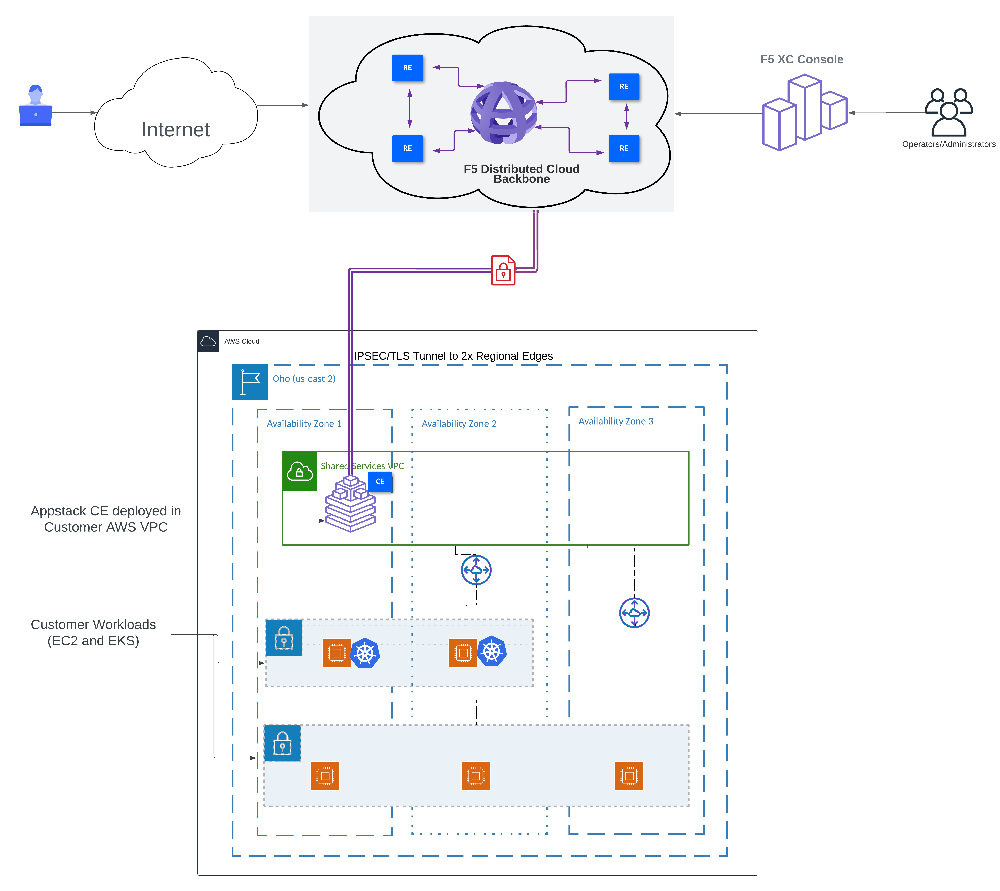
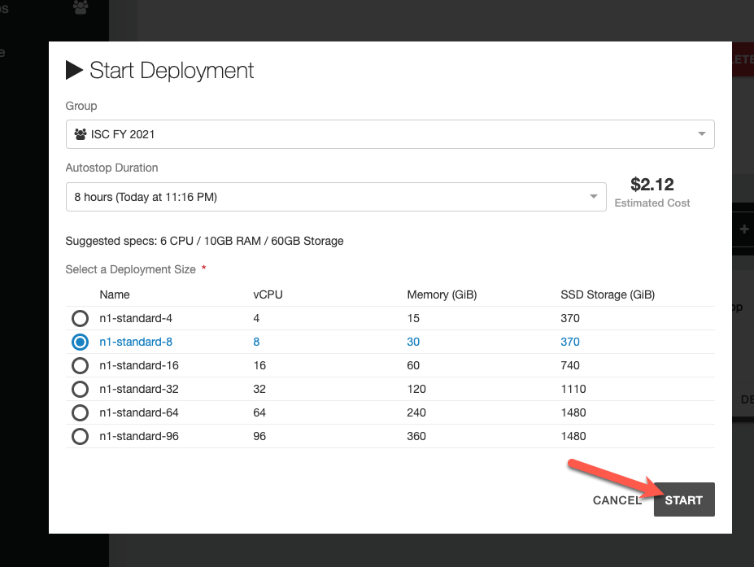

# Introduction 

This lab will introduce students to the Terraform-Modular-Demo-Framework, that uses Terragrunt to sequence terraform modules, and make the process of setting up a Modern App demo, __Ridiculously Easy__ 

Students will perform the following steps in this lab:
    1) Deploy a Managed K8s Cluster and AWS Appstack VPC site
    2) Deploy a Virtual K8s cluster and Virtual Site ()
    3) Deploy the Brewz app on both:
       3.1) recommendations and inventory services on vk8s in a Regional Edge 
       3.2) spa, mongo-initdb, checkout and api on mk8s in a Customer Edge
    4) Create Origin pools for each service (except mongo-initdb) 
    5) Create HTTPS Load Balancer with custom routes, pointing to the different services

 
## Lab Architecture


## Deploy the TechXchange UDF Blueprint 

1. In your browser, navigate to the [Terraform Modular Demo Framework](https://udf.f5.com/b/99ed0091-30c5-4a2d-b8e0-e29574980c46#documentation) blueprint.

1. Click the **Deploy** button, and deploy it in the region geographically closest to you.


    


    


1. Start the UDF deployment with the default suggested resource settings.

    

    

## Log into the **devbox** VM in the UDF Deployment

1. If the **devbox** component is not running, start it now.

1. Select the **XRDP** access method in this component.

    

    

1. Once the RDP file downloads, open it with your Remote Desktop client of choice, usually by double-clicking on the downloaded file.

1. When prompted to login, use the credentials that are shown in the **Documentation** tab of the **devbox** UDF component.

## Log into F5 Distributed Cloud Console

1. Once you started the UDF deployment, a workflow was triggered to create a user account for you in the `f5-sales-demo` tenant. You should have received an email requesting you to set your password for this account. Follow those instructions in the email.

    > **Note:** If you already have an account in the `f5-sales-demo` XC tenant, you can simply log in with your existing credentials.

1. Once you are logged into the tenant, navigate to **Multi-Cloud App Connect**.

1. In the URL, you will find the namespace that has been randomly generated for you:

    

    > **Note:** If you already have an account in the `f5-sales-demo` XC tenant, you may have a personal application namespace. If not, create one now, and note its name.

1. Make a note of the above namespace, as you will need it the upcoming step.


1. Open a terminal and run the following command  

    ```bash
    cd ~/terraform-modular-demo-framework
    ```

1. Run the following script to initiate the infrastructure build for this lab: (***Note:*** ----> Copy-paste will not work)

    ```bash
    export TF_VAR_namespace=<your xc namespace here>
    ```

1. Next, run the following command to start the UDF environment setup
    ```bash
    terragrunt run-all apply --terragrunt-modules-that-include ./env-setup.hcl 
    ```

    > **Note:** When prompted to apply, type `y` then enter. If this fails, stop and alert a lab instructor immediately


[Continue to next section ... ](lab_1.0.md)