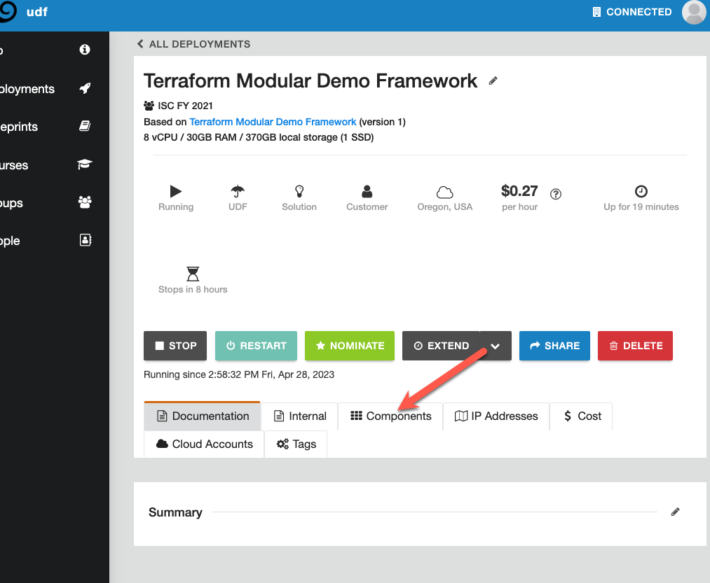

# Introduction

This lab leverages the Terraform Modular Demo Framework, that uses Terragrunt to sequence interdependent terraform modules, and make the process of setting up a Distributed Cloud Modern App demo, __Ridiculously Easy__

## Use Case:

Brewz is an ecommerce application that provides a retail storefront for customers, to purchase coffee. Of the 6 microservices that make up Brewz, there is a desire to run the *recommendations* and *inventory* services closer to customer locations, while the remaining services should be hosted on a Kubernetes cluster, that can be quickly and easily deployed in multiple locations as demand for coffee grows. F5 Distributed Cloud Regional Edges provide the capability to deploy the 2x services closer to customers, to reduce latency and improve availability, while XC App Stack provides a repeatable K8s platform, that can be platform agnostic, and host microservices, while being managed through the centralized XC Console. The XC security stack is an added bonus to this use case (we will not be covering XC WAAP in this lab).

## What components do we need to achieve this?

* Managed K8s Cluster and AWS App Stack VPC site
* Virtual K8s cluster and Virtual Site
* The Brewz app:
  + *recommendations* and *inventory* services on Virtual K8s in a Regional Edge
  + *spa, mongodb, checkout* and *core api* on Managed K8s in a Customer Edge (AWS environment)
* Origin pools for each service (except mongodb)
* HTTPS Load Balancer with custom routes, pointing to the different services

## Deploy the Terraform Modular Demo Framework

1. In your browser, navigate to the [Terraform Modular Demo Framework](https://udf.f5.com/b/99ed0091-30c5-4a2d-b8e0-e29574980c46#documentation) blueprint.

1. Click the **Deploy** button, and deploy it in the region geographically closest to you.

    

    

1. Start the UDF deployment with the default suggested resource settings.

    

    

## Log into the **devbox** VM in the UDF Deployment

1. If the **devbox** component is not running, start it now.

1. Select the **XRDP** access method in this component.

> ***Note:*** If your keyboard layout causes copy/paste or navigation issues inside the RDP session, please open the [Lab Guide](https://) inside the RDP
> <br/>
> <br/>
> ***Mac Users:*** Please use the Microsoft RDP client for MacOS for optimal RDP experience
<br/>     
    
   

> ***Note:*** If you prefer to use the SSH utility in UDF, Follow this procedure:
>1. Connect to ssh
>1. Type `screen` before running your commands. If you get disconnected from your SSH session, reconnect to ssh, then type `screen -R` to resume your running terminal session.

 <br/>

1. Once the RDP file downloads, open it with your Remote Desktop client of choice, usually by double-clicking on the downloaded file.

1. When prompted to login, use the credentials that are shown in the **Documentation** tab of the **devbox** UDF component.

## Log into F5 Distributed Cloud Console

1. Once you started the UDF deployment, a workflow was triggered to create a user account for you in the `f5-sales-demo` tenant. You should have received an email requesting you to set your password for this account. Follow those instructions in the email.

    > **Note:** If you already have an account in the `f5-sales-demo` XC tenant, you can simply log in with your existing credentials.

1. If you are prompted for an XC domain, enter `f5-sales-demo` and click **Next**.

    

1. Login using your email and the password you just set:

    

1. If prompted, review and accept the **Terms of Service** and **Privacy Policy**.

1. When asked to identify yourself, select all the checkboxes for personas, and click **Next**.

1. Click `Advanced` and click **Get Started**.


1. Once you are logged into the tenant, navigate to **Multi-Cloud App Connect**.

1. In the URL, you will find the namespace that has been randomly generated for you:

    

    > **Note:** If you already have an account in the `f5-sales-demo` XC tenant, you may have a personal application namespace. If not, create one now, and note its name. You will not receive an email to register.

1. Make a note of the above namespace, as you will need it the upcoming step.

1. Open a terminal and run the following command  

    ```bash
    cd ~/terraform-modular-demo-framework
    ```

1. Run the following script to initiate the infrastructure build for this lab: (***Note:*** ----> Copy-paste will not work)

    ```bash
    export TF_VAR_namespace=<your xc namespace here>
    ```

1. Next, run the following command to start the UDF environment setup:

    ```bash
    terragrunt run-all apply --terragrunt-modules-that-include ./env-setup.hcl 
    ```

    > **Note:** When prompted to apply, type `y` then enter. If this fails, stop and alert a lab instructor immediately

[Continue to next section...](lab_1.0.md)
