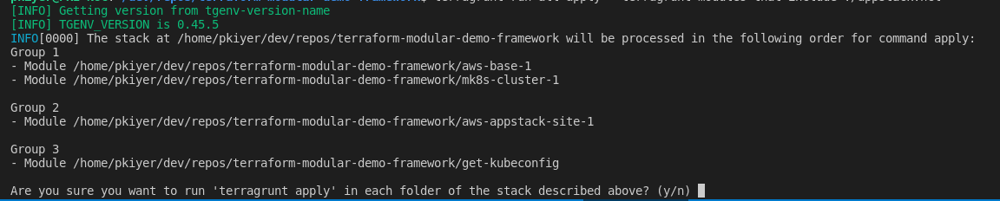

# Outline

You will deploy a Managed K8s Cluster and AWS-VPC Appstack site, in this section

Terragrunt will sequentially apply terraform modules in the order specified by the dependencies stanza (defined in the terragrunt.hcl file, inside each module directory eg: aws-base-1/terragrunt.hcl)

## Trigger build of lab environment

1. Open a terminal and run the following command to switch to the infrastructure branch we will use for this lab:

    ```bash
    cd ~/terraform-modular-demo-framework
    ```

1. Run the following command for this lab:

    ```bash
    terragrunt run-all apply --terragrunt-modules-that-include ./appstack.hcl 
    ```
You should see the following groups queued up for deployment



    > **Note:** When prompted to apply, type `y` then enter.


### PendingVerification Error

If you receive a *PendingVerification* error from AWS in your Terraform output, then proceed with the following steps:

1. Destroy the `aws-appstack-site` 

    ```bash
    cd aws-appstack-site-1
    terragrunt destroy
    ```

1. Ensure your site has been removed by checking the *Multi-Cloud App Connect -> App Site List* to ensure there are no sites with your XC username.

1. Run the deployment again

    ```.bash
    cd ~/terraform-modular-demo-framework
    terragrunt run-all apply --terragrunt-modules-that-include ./appstack.hcl
    ```

### Observe

1) Terragrunt will now sequentially apply the various terraform modules, in the order specified by the dependencies stanza (defined in the terragrunt.hcl file, inside each module directory eg: aws-base-1/terragrunt.hcl)
2) There are pre-checks and post-checks built into the framework, to check status of objects before proceeding

## Observe

1. Log into XC console

2. Select Multi-cloud Network Connect --> Site Management --> AWS VPC Sites --> (Observe the state of the site - No action needed)


3. In the same menu, look for K8s Clusters, you will see the mk8s cluster object created, as follows:


4. Under "Managed K8s", Select "Overview"
    You will observe the cluster you just create appear as a Managed K8s cluster. The status will change to green, once the VPC site is online


  > **Note:** The vpc appstack site takes over 30 mins to change to "online" state, this is expected. If you see "Applied with Errors" or "Waiting for Registration", please ping the lab instructors.
  

  If the site creation is proceeding successfully, you should see the following:


## Next Step -> [ Kubeconfig, mK8s, vK8s, LBs ](lab_1.1.md)
