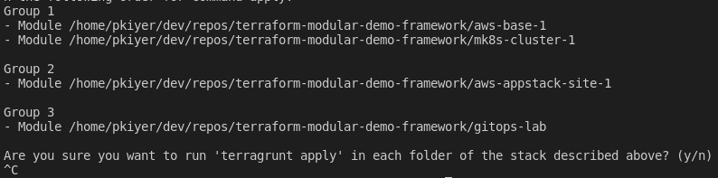

# Outline

You will deploy a Managed K8s Cluster and AWS-VPC Appstack site, in this lab. 

This lab will use Terragrunt to sequentially apply terraform modules in the order specified by the dependencies stanza (defined in the terragrunt.hcl file, inside each module directory eg: aws-base-1/terragrunt.hcl)

### Create AWS and Azure Base environments (NetOps)

1. Run the following:

  ```bash
  terragrunt run-all apply --terragrunt-modules-that-include ./appstack.hcl
  ```

### Observe

1) Terragrunt will now sequentially apply the various terraform modules, in the order specified by the dependencies stanza (defined in the terragrunt.hcl file, inside each module directory eg: aws-base-1/terragrunt.hcl)
2) There are pre-checks and post-checks built into the framework, to check status of objects before proceeding




## [Lab 1.2](lab_1.2.md) - Kubeconfig & Managed K8s
