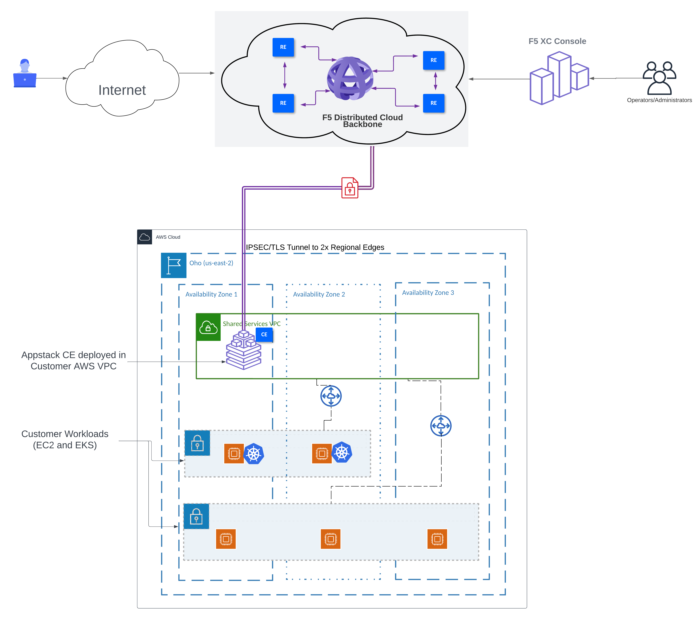
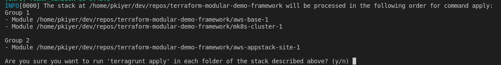
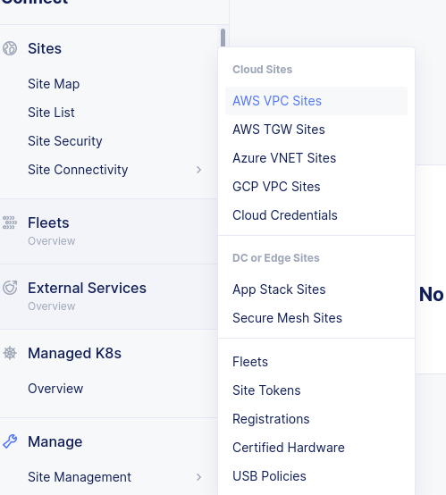
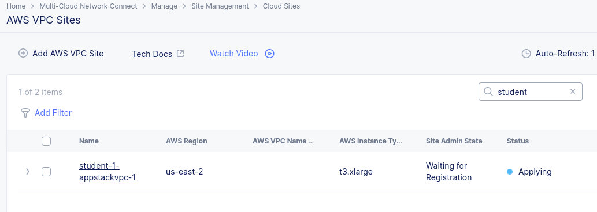
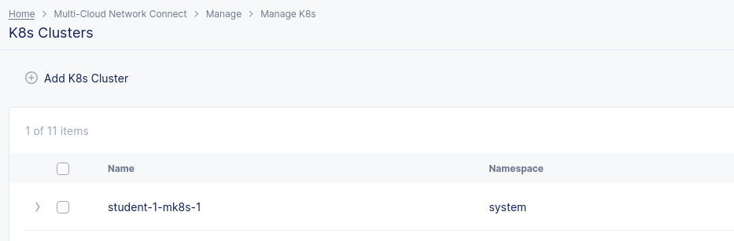
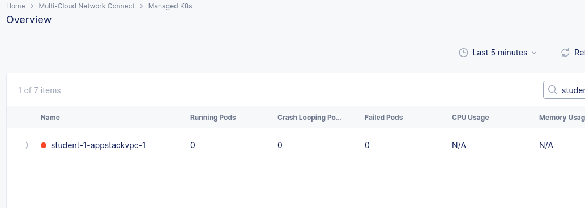

# Outline

In this section, we deploy a Managed K8s Cluster and AWS-VPC-site with an Appstack instance. The underlying AWS base environment will also be created, as shown in the architecture below




## Trigger build of lab environment

1. Open a terminal and run the following command:

    ```bash
    cd ~/terraform-modular-demo-framework
    ```

1. Run the following command for this lab:

    ```bash
    terragrunt run-all apply --terragrunt-modules-that-include ./appstack.hcl 
    ```
You should see the following groups queued up for deployment


> **Note:** When prompted to apply, type `y` then enter.

### Group 1 module definitions:  

- aws-base-1 --> deploys AWS VPCs, Subnets, Internet Gateways, Route Tables, EIPs, NAT Gateways, Security Groups, etc  
- mk8s-cluster-1 --> Deploys the XC Managed K8s Cluster object. This step is required BEFORE the AWS-VPC site is created with an Appstack node

### Group 2 module definitions:  

- aws-appstack-site-1 --> Tells XC to deploy an AWS-VPC site with an Appstack node, using outputs from the aws-base-1 module

> ***Note:*** If you see *PendingVerification Error*, go to [Pending Verification Recovery](Pend-ver.md) otherwise, proceed. 

## Verify

1. Log into XC console

2. Select Multi-cloud Network Connect --> Site Management --> AWS VPC Sites --> (Observe the state of the site - No action needed)




3. In the same menu, look for K8s Clusters, you will see the mk8s cluster object created, as follows:



4. Under "Managed K8s", Select "Overview"
    You will observe the cluster you just create appear as a Managed K8s cluster. The status will change to green, once the VPC site is online



  > **Note:** The vpc appstack site takes over 30 mins to change to "online" state, this is expected. If you see "Applied with Errors" or "Waiting for Registration", please ping the lab instructors.
  

  If the site creation is proceeding successfully, you should see the following:


<br/>
<br/>


***You must wait for the above step to complete before proceeding with the lab***

<br/>
<br/>


## Next Step -> [VK8s & Kubeconfigs](lab_1.1.md)
