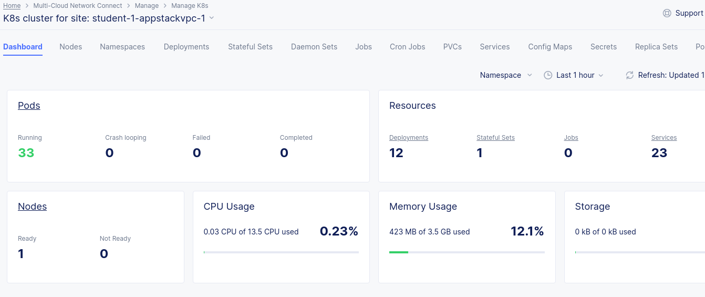
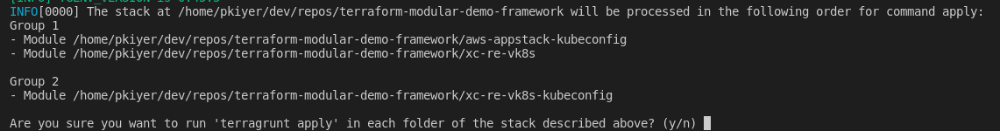

# Virtual K8s and Kubeconfigs

In the previous step, the underlying environment and Managed K8s cluster were built on an Appstack node. Once the AWS-VPC site with Appstack is alive, you should see the following:



### Deploy a Virtual K8s Cluster 
  
  In a terminal, type the following command
  
  ```bash
    cd ~/terraform-modular-demo-framework
    terragrunt run-all apply --terragrunt-modules-that-include ./virtual-k8s.hcl
  ```
The terragrunt module grouping looks as follows:



### Group 1 module definitions:  

- aws-appstack-kubeconfig --> Gets the kubeconfig from the previously deploys Managed K8s Cluster 
- xc-re-vk8s --> Deploys the XC Vk8s Cluster and associates it to a virtual site pointing to just REs

### Group 2 module definitions:  

- xc-re-vk8s-kubeconfig --> Gets the kubeconfig from the XC Virtual K8s Cluster. This module also checks to see if the Cluster is *__Ready__*


## Next Step  [Deploy Brewz](lab_1.2.md)