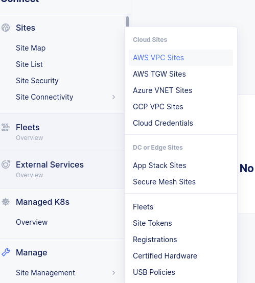

# This lab requires Platform Ops and Sec Ops to perform specific functions

The following steps are to be performed by Platform Ops Persona in each team

## Build VPC and VNET sites (Platform Ops)

1. Run the following command:

  ```bash
  terragrunt run-all apply --terragrunt-modules-that-include ./sites.hcl
  ```

## Observe

1. Log into XC console

1. Select Multi-cloud Network Connect --> Site Management --> AWS VPC Sites --> (Observe the state of the site - No action needed)



2. Under "Managed K8s", Select "Overview"
    You will observe the cluster you just create appear as a Managed K8s cluster. The status will change to green, once the VPC site is online


  > **Note:** The vpc appstack site takes over 30 mins to change to "online" state, this is expected. If you see "Applied with Errors" or "Waiting for Registration", please ping the lab instructors.

