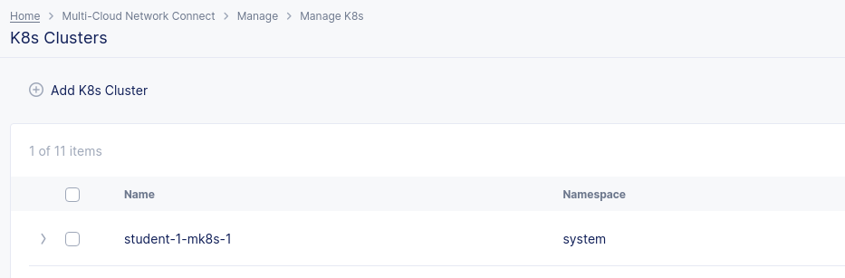
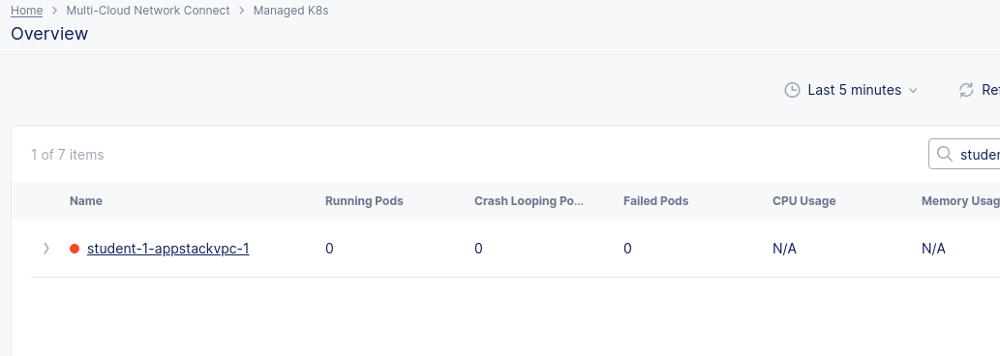
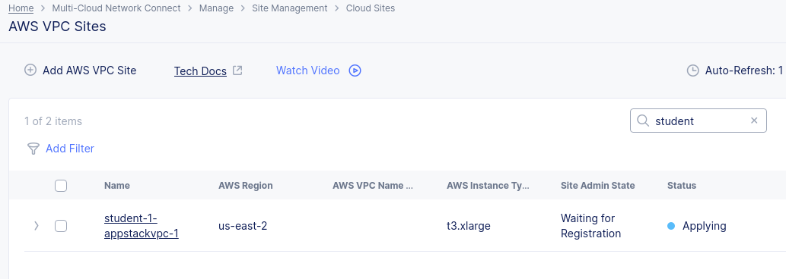

## Observe

1. Log into XC console

2. Select Multi-cloud Network Connect --> Site Management --> AWS VPC Sites --> (Observe the state of the site - No action needed)

3. In the same menu, look for K8s Clusters, you will see the mk8s cluster object created, as follows:

4. Under "Managed K8s", Select "Overview"
    You will observe the cluster you just create appear as a Managed K8s cluster. The status will change to green, once the VPC site is online

  > **Note:** The vpc appstack site takes over 30 mins to change to "online" state, this is expected. If you see "Applied with Errors" or "Waiting for Registration", please ping the lab instructors.
  

  If the site creation is proceeding successfully, you should see the following:

