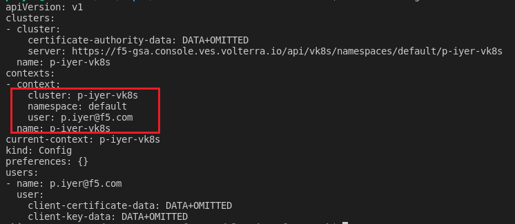

# Deploying Brewz on Virtual K8s and Managed K8s

By now, both MK8s and VK8s clusters should be *ready/alive* and a kubeconfig will have been generated and downloaded for both clusters.
<br/>
<br/>
***Note:*** Kubeconfig Locations:
  - Mk8s kubeconfig --> /home/ubuntu/.kube/config
  - Vk8s kubeconfig --> /home/ubuntu/xc-re-vk8s-kubeconfig
<br/>
<br/>

You can verify your access to each cluster using kubectl commands.

## Managed K8s Access & API Resources

To verify access to Managed K8s cluster, run the following commands in a terminal:

  ```bash
    export KUBECONFIG=/home/ubuntu/.kube/config
    kubectl config view
  ```

You should see the following:


Review the API resources available to the Managed K8s Cluster

  ```bash
     kubectl api-resources
  ```


## Virtual K8s Access & API Resources

To verify access to Virtual K8s cluster, run the following commands in a terminal:

  ```bash
    export KUBECONFIG=/home/ubuntu/xc-re-vk8s-kubeconfig
    kubectl config view
```

The output looks as follows:



***Note:*** The cluster name points to the vk8s cluster object you deployed earlier

Review the API resources available to the Managed K8s Cluster
  
  ```bash
     kubectl api-resources
  ```


> ***Note:*** You will observe that the Managed K8s cluster has a much larger set of API resources available, compared to the Virtual K8s cluster. This is because the XC Managed K8s feature provides a full K8s cluster in a site, while the XC Virtual K8s feature only provides a namespace, that can span multiple sites (including an MK8s site).

## Next Step  [Brewz App, LB & Routes](lab_1.3.md)
