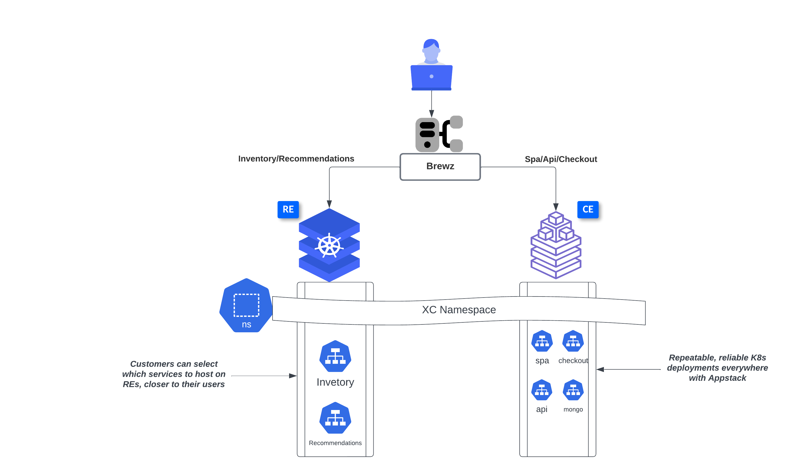
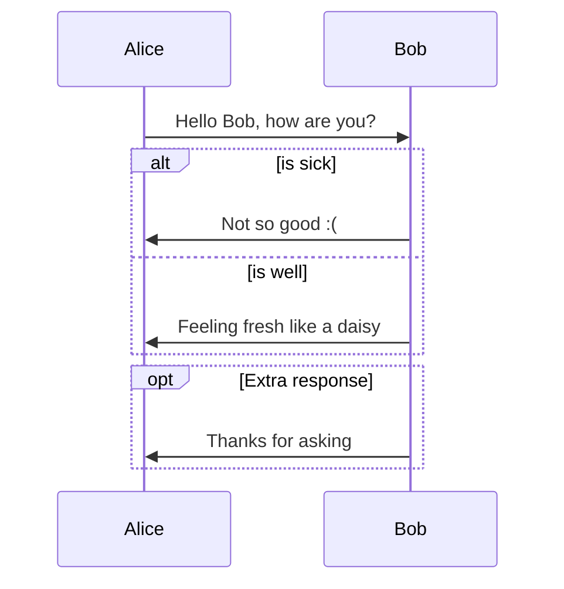

### Deploy select Brewz manifests on vK8s

In a terminal, type the following command
  
  ```bash
    cd terraform-modular-demo-framework
    terragrunt run-all apply --terragrunt-modules-that-include ./brewz.hcl
   ```
The output should look as follows


This module will perform the following:
1) Deploy recommendations and inventory services to the vk8s cluster 
2) Deploy spa, mongo-initdb, checkout and api services to the mk8s cluster
3) Create the origin pools pointing to each K8s service, selecting the site/vsite reference depending on the cluster
4) Create an HTTPS Load Balancer, with custom routes pointing to the origin pools created above


The intended outcome of the above steps should result in this architecture 




### Review Objects/Routes
Within a few minutes, you will see a HTTP Load Balancer appear in your XC namespace


Review the routes created for the app   
Click "Manage Configuration" on the load balancer object


Then, under "Routes", click on "View Configuration"


You should see several routes created for Brewz services


A quick way to view where each service was deployed on the XC Console is to go to Distributed Apps --> Virtual Hosts --> HTTP Load Balancers --> (Click on your LB)


Now Click on Origins, and observe the "Site" column, to identify which service was deployed on which cluster


