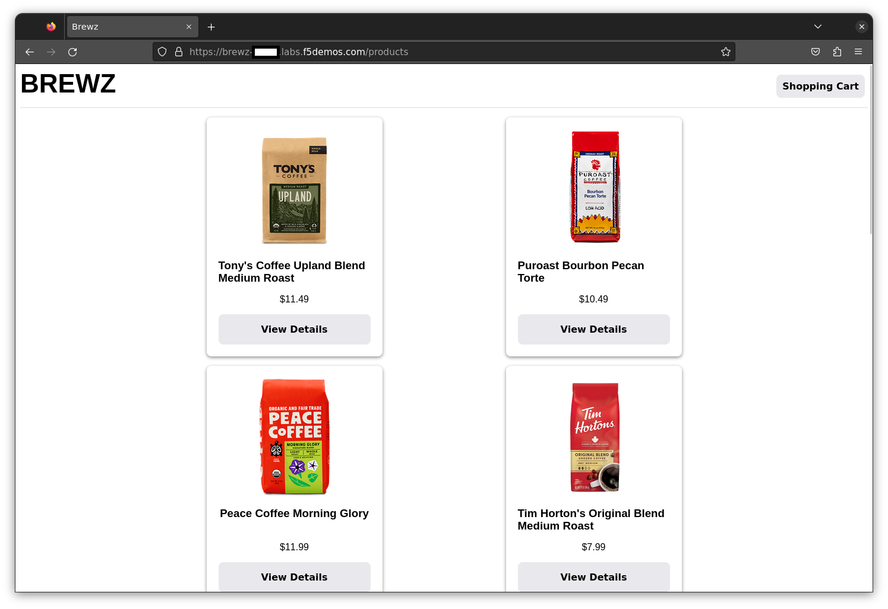

## Deploy select Brewz manifests on vK8s

Now that all the required infrastructure is available, it is time to deploy Brewz.

In a terminal, type the following command:

  ```bash
    terragrunt run-all apply --terragrunt-modules-that-include ./brewz.hcl
   ```

  > **Note:** When prompted to apply, type `y` then enter. Once the script triggers, do not interrupt the terminal session until it finishes and returns to the prompt

The output should look as follows:


### Group 1 module definition:

The *appstack-lab.hcl* group will perform the following:
1) Deploy recommendations and inventory services to the Vk8s cluster
2) Deploy spa, mongo-initdb, checkout and api services to the Mk8s cluster
3) Create the origin pools pointing to each K8s service, selecting the site/vsite reference depending on the cluster
4) Create an HTTPS Load Balancer, with custom routes pointing to the origin pools created above
<br/>
<br/>

The outcome of the above steps will result in this deployment architecture. The same namespace could be extended to multiple CE sites, to distribute the application across different K8s clusters (On-prem and Cloud Sites)


### Review Objects/Routes

Within a few minutes, you will see a HTTP Load Balancer appear in your XC namespace. In the XC Console, click on *Multi-Cloud App Connect* --> *Manage* --> *HTTP Load Balancers*
<br/>
<br/>

<br/>
<br/>
Review the routes created for the app
Click "Manage Configuration" on the load balancer object

<br/>
<br/>
Then, under "Routes", click on "View Configuration"

<br/>
<br/>
You should see several routes created for Brewz services
<br/>
<br/>

<br/>
<br/>

A quick way to view where each service was deployed on the XC Console is to go to *Multi-Cloud App Connect* --> *Virtual Hosts* --> *HTTP Load Balancers* --> (click on your LB)
<br/>
<br/>


Now click on *Origins*, and observe the *Site* column, to identify which service was deployed onto each cluster.
<br/>
<br/>

<br/>
<br/>

To view the application, open a browser from anywhere, and navigate to your FQDN
<br/>
<br/>
> ***Note:*** remember to replace <xc_namespace> in the link below with your XC Namespace

[https://brewz-xc-namespace.labs.f5demos.com](https://brewz-xc-namespace.labs.f5demos.com)
<br/>

<br/>
<br/>

## Next Step  [Ridiculously Easy Demos](lab_1.4.md)
