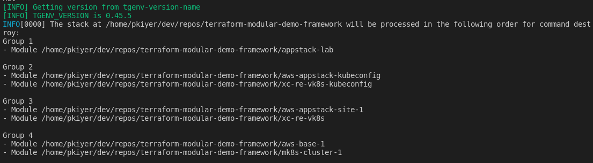

###Cleanup Lab Environment

## Trigger destroy of lab environment

1. Open a terminal and run the following commands:
    ```bash
    cd ~/terraform-modular-demo-framework
    terragrunt run-all destroy --terragrunt-modules-that-include ./appstack-lab.hcl
    ```

The output looks as follows:



Carefully observe the groups and sequences in which the modules will be applied to destroy the environment. Terragrunt provides this flexibility to perform a full destruction using a single command. 

> ***Note:*** If you want a *Ridiculously easy* method to reproduce this demo, just replace "destroy" with "apply" in the  command above, following the env-setup step in [Lab 0.0](lab_0.0.md)