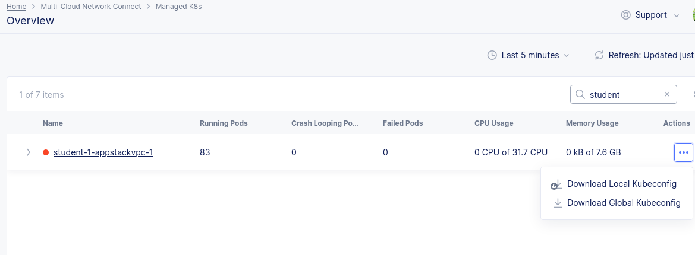
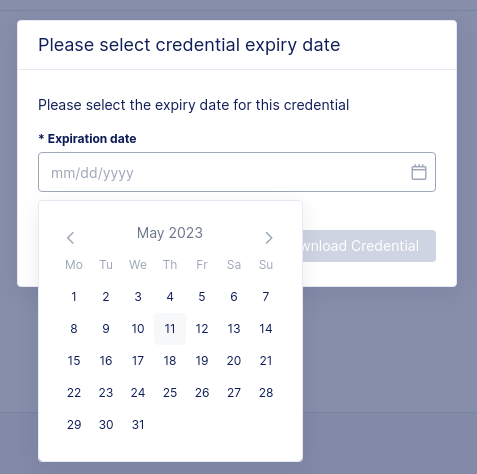
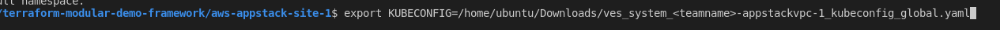

## Lab 2.0
### Managed K8s on Appstack

In the previous step, the vpc site with appstack was created. Once the site is on, it looks as follows:


### Observe
    Notice that you are able to view the AWS cluster size and system utilization details from the XC console, as well as the number of deployments/replicasets/jobs and services 

### Get The Kubeconfig
1) Navigate to Managed K8s --> Overview --> (search your student-ID in the search bar)
2) Click the sandwich menu under "Actions"

3) Click on "Download Global Kubeconfig"
   
   ***Note:*** You will notice that the "Download Local Kubeconfig" option is locked out for for the Managed K8s cluster. This is normal since XC requires the use of Global Kubeconfig to deploy apps
4) Next, you will be prompted to specify an expiration date for the Kubeconfig. Choose 1  day out, and click "Download Credential"


5) The kubeconfig will be downloaded in the /home/ubuntu/Downloads directory. Now go to vscode and set the KUBECONFIG as follows (*** Replace "teamname" with your custom "teamname"):

```bash
export KUBECONFIG=/home/ubuntu/Downloads/ves_system_<teamname>_appstackvpc-1_kubeconfig_global.yaml
  ```
